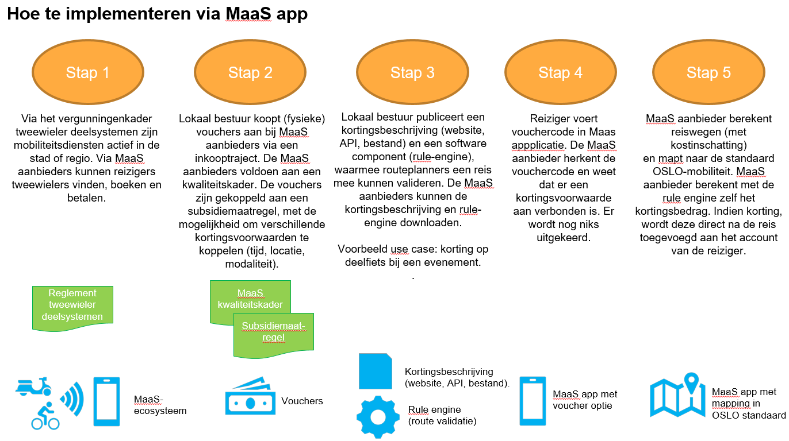

# Derdebetalersregeling voor Mobility as a Service

Dankzij Mobility as a Service (MaaS) applicaties worden burgers gestimuleerd om openbaar vervoer en deelmobiliteit te integreren in hun verplaatsingsgedrag. Met MaaS krijgen reizigers beter in kaart welke routes (en wat hun kost is) mogelijk zijn om hun verplaatsing te maken. Door hierop in te zetten kunnen steden en gemeenten uitdagingen zoals luchtkwaliteit en file-verkeer beter aanpakken. Eén manier is om te werken met een derdebetalersregeling. Dit houdt in dat een burger een korting krijgt van een lokaal bestuur indien de afgelegde reis voldoet aan bepaalde voorwaarden, bijvoorbeeld: was de verplaatsing afgelegd tijdens de spits of is een deelfiets gebruikt?

## Stap 3: de subsidiemaatregel en rule engine

In deze stap beschrijven we hoe een subsidiemaatregel voor de derdebetalersregeling voor MaaS beschreven kan worden, conform de standaarden van Gelinkte Besluiten als Linked Open Data (LBLOD). Ook beschrijven we hoe de code van de rule-engine eruit ziet.
Ten slotte demonstreren we met een Proof of Concept hoe regels opgebouwd kunnen worden en vervolgens zo'n rule-engine automatisch gegenereerd kan worden.

## Stap 4: Vouchercode detecteren

De MaaS-app weet van bij stap 2 dat een set vouchers gekoppeld zijn met een subsidiemaatregel.
Een Maas-app moet met andere woorden bijhouden (bv. een extra kolom toevoegen in de databank) welke subsidiemaatregel van toepassing is per vouchercode.

## Stap 5: Validatie

### een reis beschrijven met OSLO-Mobiliteit

In deze sectie beschrijven we hoe een reis beschreven kan worden met de OSLO-mobiliteitsstandaard voor "trips en aanbod". Het is namelijk cruciaal voor de rule engine dat de input van MaaS-apps op dezelfde manier beschreven is, ongeacht hoe deze in de back-end exact bijgehouden wordt.

Deze standaard is een Applicatie-Profiel (AP) en beschrijft adhv een UML-diagram welke entiteiten met bijhorende relaties en attributen uitgewisseld kunnen of moeten worden. Het belangrijkste om op te merken is dat er achter de schermen gewerkt wordt met globale identificatoren (URI's) om deze zaken te beschrijven. Het gebruiken van HTTP URI's, wat één van de bouwblokken van Linked Data is, zorgt ervoor dat iedereen op dezelfde manier naar iets verwijst. Dit heeft als voordeel dat je de term kan opzoeken (bv. https://schema.org/Trip om aan te duiden dat iets een Reis is) om zeker te zijn dat hetzelfde bedoeld wordt en dit is niet gevoelig voor bepaalde schrijfwijzes. Eenmaal de URI vast staat, wordt deze niet zomaar meer gewijzigd. Dankzij deze AP-standaard kunnen developers opzoeken wat de afspraak is, namelijk welke URI's gebruikt moeten worden. Om Linked Data te beschrijven zijn verschillende formaten mogelijk, maar de focus hier ligt op het gebruik van JSON-LD. Indien dit nog onbekend klinkt, verwijzen we graag door naar de JSON-LD spec: https://www.w3.org/TR/json-ld11/#basic-concepts 

Voor derdebetalersregeling in MaaS-apps dient enkel het reizigersdeel van het AP geïmplementeerd te worden. Deze kan je hieronder zien:
[oslo-reis](oslo-reis.PNG)

### valideren met rule engine

Hoe kan een Maas-partij valideren met de rule-engine

